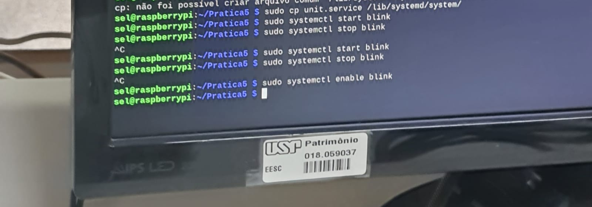
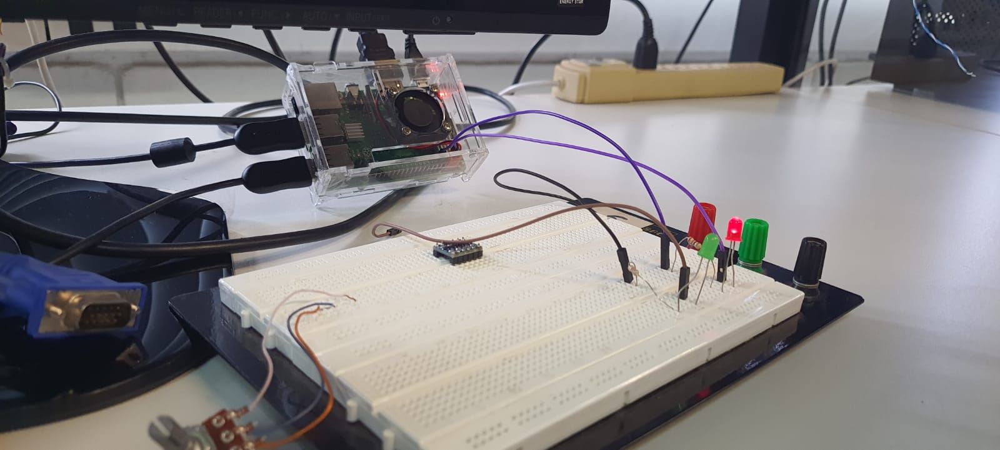
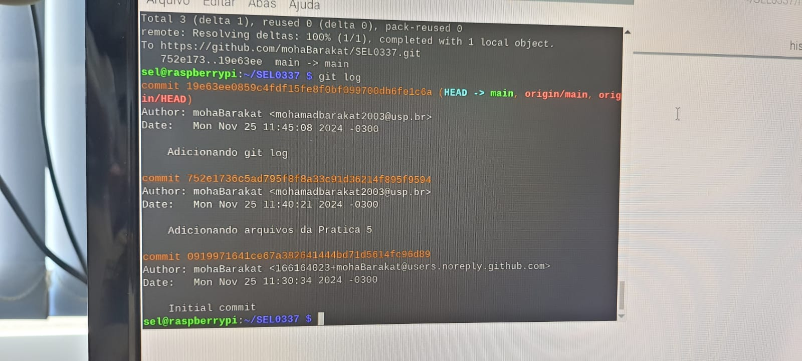

# SEL0337

## Parte 1

Para a parte 1, foi escolhido um programa de inicialização (ExecStart) que pisca um LED vermelho (arquivo blink_led.py) e quando o arquivo .service é parado (ExecStop), o LED permanece aceso sem piscar. Para isso foi feito um circuito, no qual o GPIO 2 da Raspberry pi é conectado ao catodo de um LED, enquanto o anodo permanece aterrado. Além disso, o arquivo .service utilizado foi o . Os comandos no terminal podem ser visto na foto a seguir.

Além do que foi mostrado na foto, foi utilizado o comando sudo systemctl daemon-reload.

O código utilizado após o reboot da Raspberry pi foi o código  e pode ser visto em . Já o código de parada é o  e pode ser visto na foto a seguir.

## Parte 2

Para a parte 2, foi criado um repositório para os arquivos citados anteriormente e foi mandado para o github usando os comandos "git clone" "git add .", "git commit -m "mensagem"" e "git push". Além disso, foi criado um token no github para que seja possível fazer o comando "git push". Por fim, foi incluído o  e foi mandado junto para o repositório. Vale ressaltar que o próprio envio do histórico adicionou uma mudança no git log e este pode ser visto completo na imagem a seguir.

